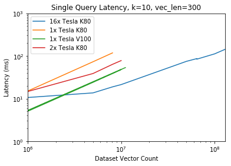

# brute_knn_benchmarks
Performance measurements on brute-force k-NN implementations on GPU and CPU

# Observations

The following plot shows a comparison of the time taken to perform a single k-NN search on various GPU configurations. All measurements in this plot are with a vector length of 300 and k=10 neighbors.

* "Single Query" - Perform a search using a single query vector.
* "Batch Query" - Perform a search using multiple query vectors supplied all at once.

CPUs and GPUs tend to be more efficient at matrix-matrix operations than vector-matrix.

Example: Generate the full knn-graph (with k=10) for a word model, containing 1,000,000 words with 300 features.
| GPU  | Time Required | Total Cost |
| ------------- | ------------- | ------------- |
| 1x K80  | 0.095 hrs  | $0.09  |
| 1x V100  | 0.014 hrs  | $0.04  |

## Scripts

### faiss_gpu_benchmark.py
This script measures brute force k-NN performance on GPUs using the FAISS 
library. All experimental results are appended to the `benchmark_tests.csv` 
file.

### find_max_dataset.py
This script is used to determine, through experimentation, the maximum dataset
size supported by FAISS on a particular GPU configuration.

This script attempts to load a dataset of a particular size, and records 
whether the load succeeded or failed. All of the attempts (and whether each 
failed or succeeded) are stored in a .csv file: `max_dataset_size.csv`

On each attempt, it looks at the largest size that has succeeded and the 
smallest size that has failed, and then tries the size halfway between them.

The script rounds the vector counts to the nearest 10,000 so that the numbers
are a little less ugly. But you can remove this step if you wish to find the 
*exact* number.

One unfortunate detail is that when the dataset is too large, cudaMalloc throws
an exception which crashes Python, so we can't programmatically determine that
the size was too large. To work around this, the script first records
the test run as a _failure_ in the .csv table, and then goes back and changes 
it to a success if it doesn't crash.

IMPORTANT: If you encounter any errors in running this script, other than a cuda malloc failure, you'll need to manually remove the result from the .csv file.